# Introduction

Currently, there are a variety of image processing features available across multiple programming languages. Many of them require a lot of lines of code or are hard to use due to the technical jargon that is associated with digital signal processing; which also makes the documentation difficult to understand. Our focus in this project is to develop a language that is straightforward for users that are not necessarily knowledgeable of image processing or digital signal processing in general. We expect that the learning curve for our proposed programming language is far from steep so that users can swiftly modify images as they want to. Users can do this by importing an image and applying a variety of operations to an image such as scaling, sharpening, and feature extraction via our programming language. Our proposed language will be implemented using PLY, the python scanner/parser tool that will allow us to create the straightforward syntax of SIP. The python libraries of Scipy and Numpy will be used since they will allow us to manipulate the vectors/matrices associated with the images while also having some toolboxes for image/signal processing. Finally, matplotlib will be used to render the images and display the effects that the user executed.

# VIDEO TUTORIAL

[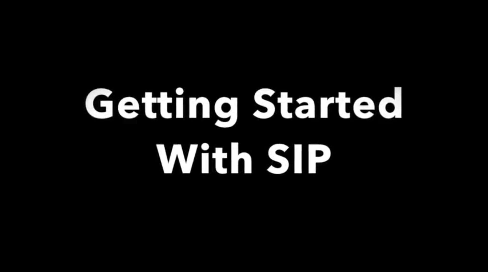](https://youtu.be/DRmtQ3VHD1g)

# SIP GRAMMAR

# Installation

## Dependencies

Make sure to have Python 3 version 3.6.5 installed and the following libraries installed:
* PLY 3.11
* Scipy 1.0.1
* Numpy 1.14.3
* Matplotlib 2.2.2
* Scikit-image 0.13.1

# Reference Manual

## Types

**2D Images**
*	Also known as binary images, these types are only capable of performing tasks that do not require the image being modified to have 3 dimensions represent them. Performing a wrong command will result in a warning explaining so.

**3D Images**
*	All types of images represented with 3 dimensions, each representing their respective colors (RGB).

## Variables

All variables will only be images represented as arrays of numbers representing pixels and can only be initialized by assigning an image or assigning it to a command reading an image file. 

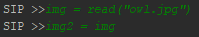

## Functions

**read(“FILENAME”)**
*	**read** - Reads an image from a file, used for variable initialization.
*	**Parameters:** File containing the image to be read.

**Example:**

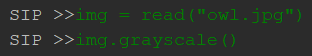

**grayscale()**
*	Converts a 3D image to a 2D image composed exclusively of different shades of gray.

**Example:**

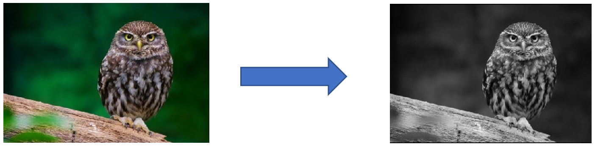

**sepia()**
*	Converts an image to sepia tones, mostly used to represent aging of old images.

**Example:**

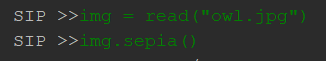
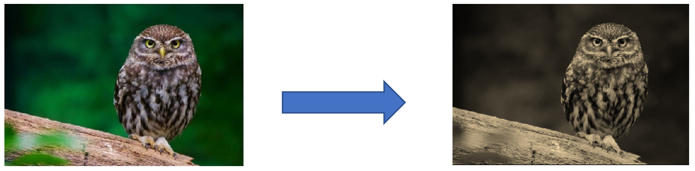

**red()**
*	Converts a 3D image to 2D by extracting only the red tones.

**Example:**

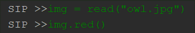
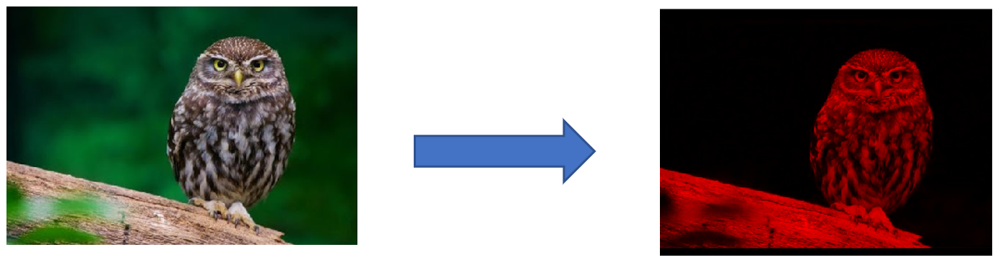

**green()**
*	Converts a 3D image to 2D by extracting only the green tones.

**Example:**

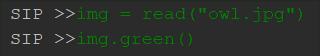
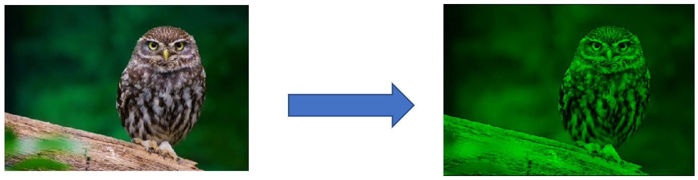

**blue()**
*	Converts a 3D image to 2D by extracting only the blue tones.

**Example:**

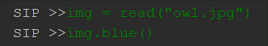
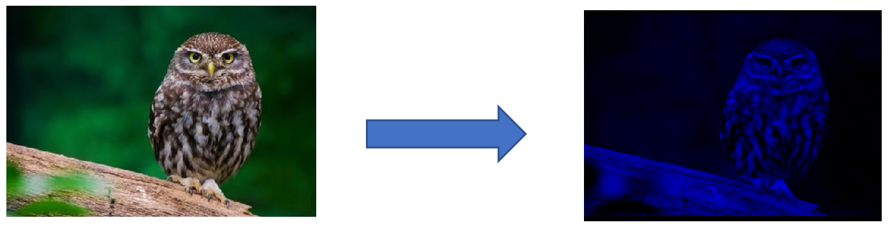

**invert()**
*	Inverts the color of each individual pixel, creating the effect of a negative image

**Example:**

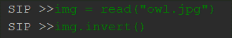
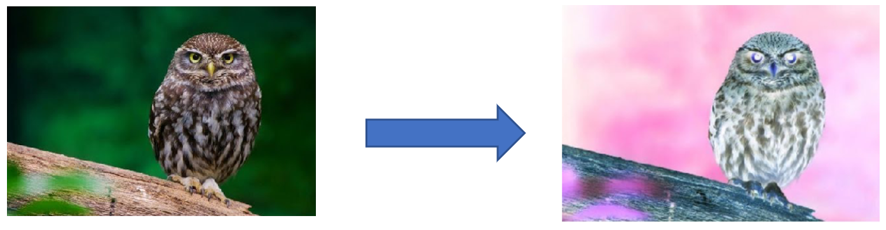

**show()**
* Shows the current state of the image stored in a given variable

**Example:**

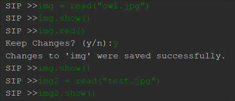
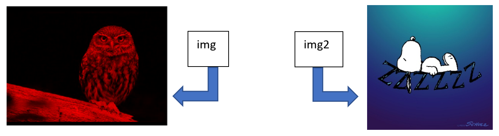

**blur(LEVEL)**
*	**Parameters:** Will require the user to input intensity LEVEL of the blur in the form of **medium**, **low** or **high**.
*	**blur** – It will reduce image noise and reduce detail to the image this function is being used on. 

**Example:**

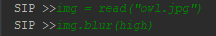
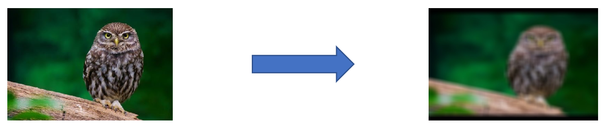

**rotate(DIRECTION)**
*	**Parameters:** Will require the user to input which DIRECTION would he like it to rotate to, **right** or **left**.
*	**rotate** – Will rotate the image 90 degrees to the side that was input. 

**Example:**

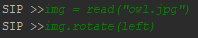
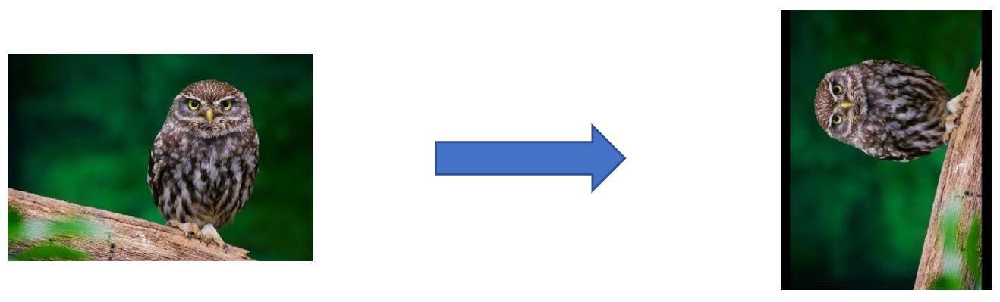

**edges(LEVEL)**
*	**Parameters:** Will require the user to input intensity LEVEL of the blur in the form of **medium**, **low** or **high**.
*	**edges** – Finds the boundaries of objects within the images. Works by detecting discontinuities in brightness. This method can only be called onto 2D images. 

**Example:**

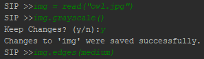
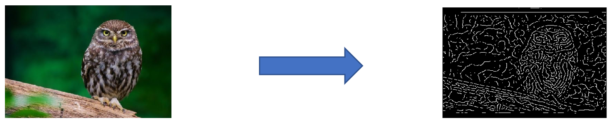

**sharpen(LEVEL)** 
*	**Parameters:** Will require the user to input intensity level of the blur in the form of **medium**, **low** or **high**.
*	**sharpen** – Emphasizes the texture and drawing viewer focus to the image. 

**Example:**

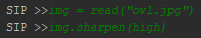
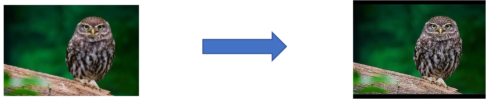

**save(“FILENAME”)**
*	**Parameters:** Will require the user to input the name of the new file to be saved as well as its image format between quotation marks. 
*	**save** – Will save the copy of the image being used onto the project folder with the name given.

**Example:**

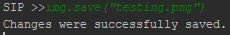

**resize(height, width)**
*	**Parameters:** Will require the user to input the Width and Height preferred onto the image, the width and height must be positive integers.
*	**Resize** – Will resize the image to fit the dimensions used as parameters. 

**Example:**

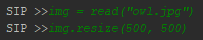

**crop(height, width)**
*	**Parameters:** Will require the user to input the Width and Height preferred onto the image,the width and height must be positive integers.
*	**Crop** - Crop with respect to the center of the image, parameters cannot be larger than the dimensions of the image.

**Example:**

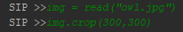
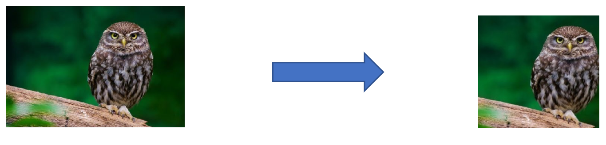

**spiral(strength, radius)**
*	**Parameters:** Will require the user to input the strength of the spiral and the radius onto which it will apply the spiral animation on the picture; the width and height must be integers.
*	**Spiral** – Will apply a spiral effect onto the image. 

**Example:**

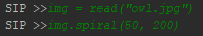
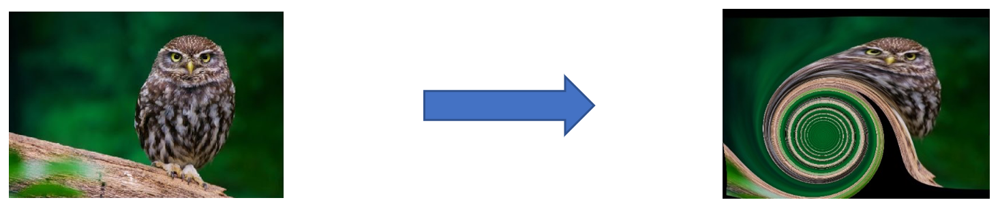

# Language Development

## Translator Architecture

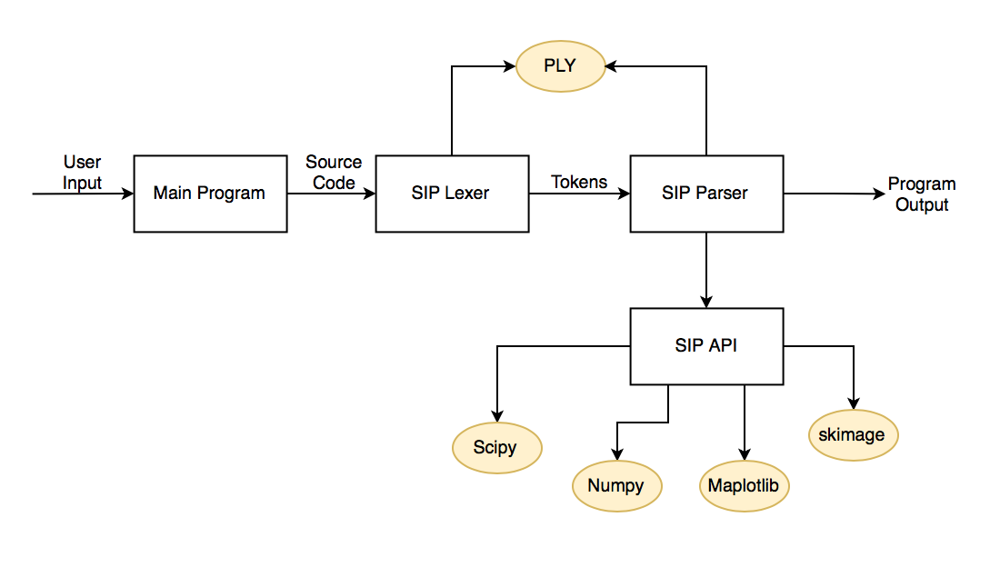

## Interfaces Between Modules

*	**Main Program:** Is the module that ties the SIP Language altogether, it waits for user input to the invoke the sip Lexer and Parser to then finally start the code generation process.

*   **SIP Lexer:**  SIP Lexical analyzer was designed using the Library PLY. Here the token specifications are declared and the regular expression that is necessary to match the tokens given by the user when they input SIP code.

*   **SIP Parser:** The SIP Parser was designed using PLY as well. The tokens received from the lexer to the parser, we need to determine if they follow the grammar rules of our language. This module is in charge of specifying the grammar rules using a Backus-Naur Form (BNF) Automata. After the parser deemed the user input as a valid grammar expression, then we can execute the corresponding intermediate code within SIP’s API.

*   **SIP API:** This module was developed using the following python libraries: Scipy, Numpy, Matplotlib, and skimage. Here is where are intermediate code resides and it is executed depending on which grammar rule the parser identifies in the tokens that the user inputs. This is where the image transformations and operations occurs.

*   **Python Libraries:**  The modules in yellow in the figure above are all the libraries used in SIP Lang, these are: Scipy, Numpy, Matplotlib, Skimage, and Ply.

## Software Development Environment

The following Programs were used in the development process of SIP Language:

*	**PyCharm:** Is a Python IDE were we could write all develop, implement, and test, to make the SIP Language translator functional. In addition, the version of Python used in our code was Python 3.6.5.

*   **Virtualenv:** Is a tool to create isolated python environments and it is also package manager that helps you install the dependencies in your project.

*   **GitHub Desktop:** Is a version control software to share and monitor the code among our team of developers.

## Test Methodology

The modules within SIP Lang where tested using **Blackbox Testing**, where testers provide the inputs and observe the outputs. If the output was incorrect with respect to their corresponding input, then further testing was done until it gives a valid output.

## Programs to Test Translator

**Some Examples of the Programs to Test the Lexer:**

The objective of the programs to test the lexer was to see if the lexer applied correctly the regular expression and identified the token related to that regular expression.

**Program 1**
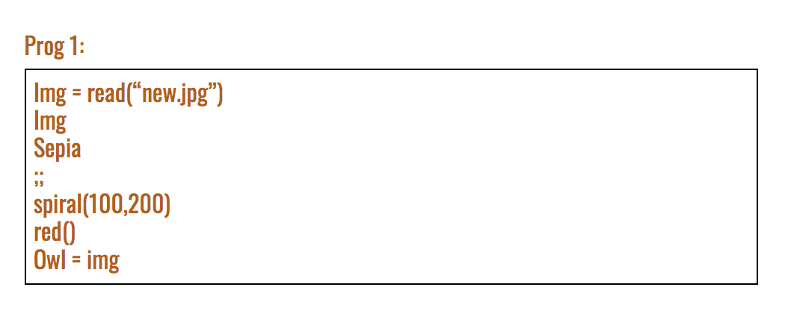

**Program 2**
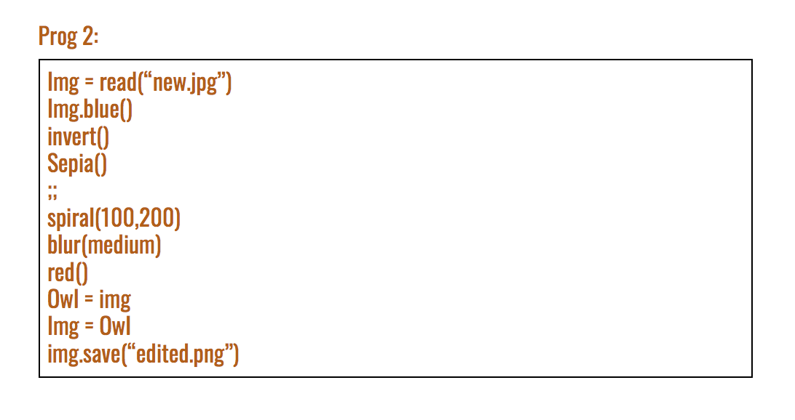

**Some Examples of the Programs to the Test Parser:**

The goals of these programs was to test the parser was to see if the parser could find a grammar rule that applied to the tokens that the lexer identified.

**Program 3**
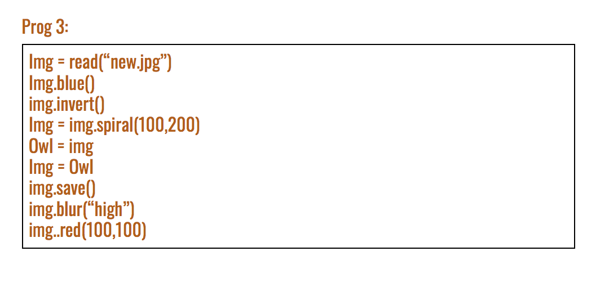

**Program 4**
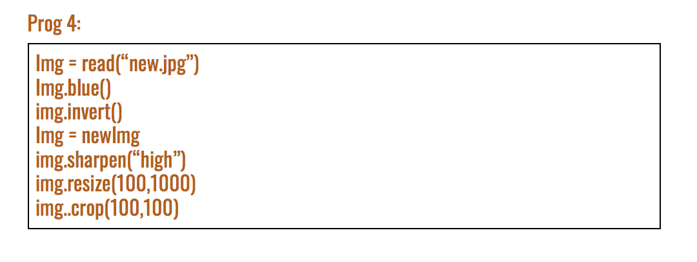

**Some Examples of the Programs to Test the Complete SIP Language Translator:**

The purpose of the programs to test the SIP translator was to see if our translator could identify which syntax that the user inputs is correct and that the corresponding piece of Intermediate code in SIP Language API executed successfully.

**Program 5**
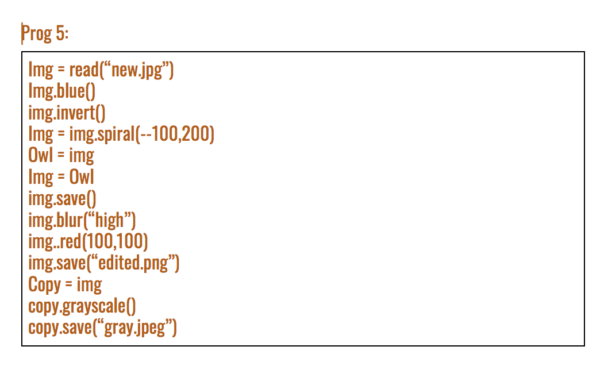

**Program 6**
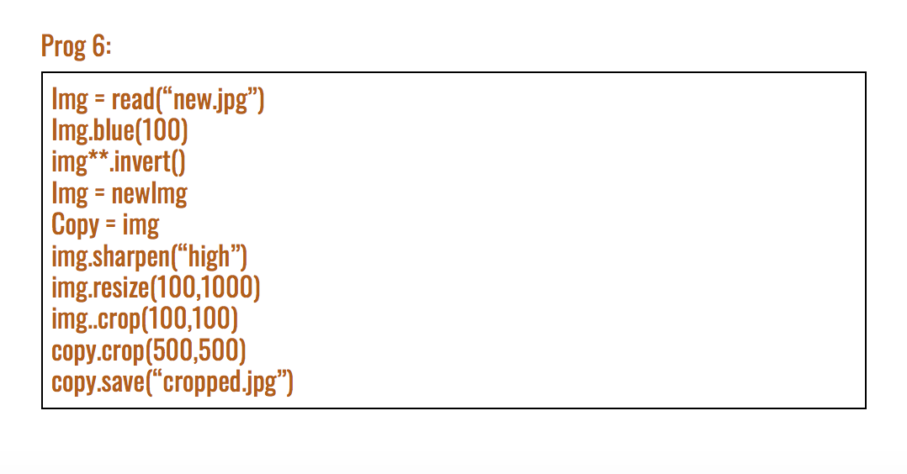

# Conclusion

  The completed language implementation provides some of the more common image processing methods with a simpler syntax, appropriate error handling, and parameters that are easier to understand. Methods which previously required complex user input have been implemented on SIP to work with levels (‘low’, ‘medium’, and ‘high’). Furthermore, the rotate method which normally requires the user to implement the number of degrees to rotate and the origin point for the rotation, has been simplified to work with 90-degree rotations with the origin set to the center of the image. After comparing code snippets between other implementations of these methods and the implementations done in this project, we can see a reduction in line of codes, which was one of the project’s goals. In addition, we can perceive the simplicity of the parameters used in SIP, when comparing it with other implementations. Overall, this language provides higher most image processing methods with better accessibility, since users can understand it even with little or no previous knowledge of image processing languages.

